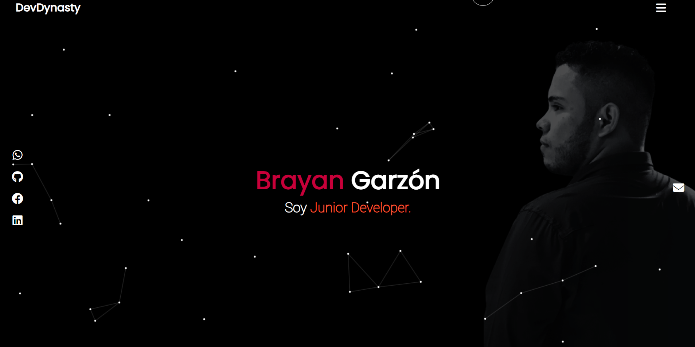

# Mi Personal Website

Este es mi sitio web personal, una plataforma en la que puedo compartir mi trabajo, proyectos y experiencias. Está construido utilizando una variedad de tecnologías, incluyendo Vue.js, CSS, JavaScript, PostgreSQL y Django.

## Características

- **Portafolio de Proyectos:** Muestra una selección de mis proyectos más recientes y destacados, permitiendo a los visitantes obtener una vista rápida de mi trabajo.

- **Blog Personal:** Mantengo un blog en el sitio donde escribo sobre mis experiencias, conocimientos y novedades en mi campo.

- **Base de Datos PostgreSQL:** Utilizo PostgreSQL para almacenar y gestionar datos, lo que me permite ofrecer un rendimiento eficiente y una escalabilidad sólida.

- **Django Backend:** El backend del sitio está construido con Django, lo que facilita la gestión de usuarios, contenido y la lógica de negocio.

## Tecnologías Utilizadas

- **Vue.js:** Utilicé Vue.js para crear una interfaz de usuario interactiva y receptiva.

- **CSS:** La apariencia y el diseño del sitio se han personalizado utilizando CSS para lograr un aspecto único.

- **JavaScript:** Se han utilizado múltiples scripts en JavaScript para agregar funcionalidad adicional a la experiencia del usuario.

- **PostgreSQL:** La base de datos PostgreSQL almacena los datos del sitio, incluyendo proyectos, entradas del blog y comentarios.

- **Django:** El backend se desarrolló en Django, proporcionando una estructura sólida para gestionar rutas, usuarios y la base de datos.
